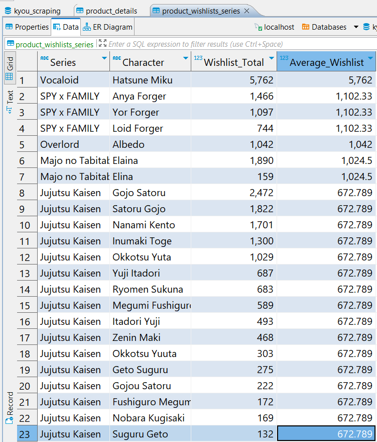

# Kyou Scraper and Data Ingestion

A Python project for scraping product details from the kyou.id, a website to purchase game or anime related (hobby) merchandise, using Selenium and BeautifulSoup and ingesting the data into a MySQL database.

## Table of Contents

- [Features](#features)
- [Prerequisites](#prerequisites)
- [How to Run](#how-to-run)
  - [Installation](#installation)
  - [Configuration](#configuration)
  - [Usage](#usage)
- [Code Explanation](#code-explanation)
- [Results Explanation](#results-explanation)
- [Conclusion and Future Updates](#conclusion-and-future-updates)

## Features

- Scrapes product details including title, price, wishlist count, and more from kyou.id.
- Cleans and processes scraped data.
- Ingests cleaned data into a MySQL database.
- Calculates the average wishlist count for products in the same series.

## Prerequisites

Before you begin, ensure you have met the following requirements:

- Python 3.7+
- Selenium WebDriver
- BeautifulSoup
- MySQL Connector
- Pandas (for data cleaning)

## How to Run

### Installation

1. Clone this repository.
2. Make sure to install the required Python packages in the requirements section.

### Configuration
Change the following MySQL configuration in main.py into your configuration:


### Usage
1. Open terminal / CMD and change the directory to the cloned repository folder
2. Run the `main.py` in your terminal:
    ```console
    python main.py
    ```
    

    While running, `Invalid first_paint 0.69 s for first_image_paint 0.677 s` might appear. This error is about the web performance and does not really affect the result.

    After running `main.py`, a chrome browser will open and the program will scroll down until the end of the page to take each products' url first. After that the program will open the next page and do the same process until the last page defined in `main.py`, which is page 25. You can change this if you want.

    

    After the getting the urls of product page from all the 25 pages, the program will open each product urls to scrape each products' details.

    

    After that, the program will write the data into csv and then ingest the written csv into MySQL database `kyou_scraping`.
    
     
    
    


## Code Explanation
The project directory should have the following structure:

- `main.py`: The main Python script for running the scraper and ingesting data into MySQL.
- `README.md`: The README file for your project.
- `lib/`: A subdirectory containing your project's Python modules.
    - `__init__.py`: An empty `__init__.py` file that marks the directory as a Python package.
    - `kyou_scraper.py`: Module for scraping product details from kyou.id.
    - `ingest_to_mysql.py`: Module for ingesting data into MySQL.
- `img/`: A subdirectory to store images used in the README.

Here is the help on `main.py`:


Here is the help on `kyou_scraper.py`


Here is the help on `ingest_to_mysql.py`


## Results Explanation


With the help of `kyou_scraper.py`, the program scrape products' detailed information, which are Title, Status, Price, Wishlist, Character, Series, Category, and Manufacturer. After that, the program clean the scraped data:
- Using regex, the program change the Price format from string "IDR 580,000Earn 580 Friendship Points" into an integer "5800000".
- Using regex, the program change the change the Wishlist format from string "1254 Wishlist" into an integer "1254".
- The program trim extra whitespaces in Title column.
- The program excludes the "Prototype Showcase" Status before writing to CSV and ingesting to MySQL because a products with this status have NULL Price.



The program created the table `product_wishlist_series` based on the `product_details` table with columns Series, Character, Wislist_Total, Average_Wishlist. This table is used to see, which series is the most favorite among all products series. It turns out, Vocaloid series is the top 1 despite only have products with 1 character "Hatsune Miku". The series in top 2, top 3, and top 4 consecutively are SPY x FAMILY, Overlord, Majo no Tabitabi, and Jujutsu Kaisen. 

## Conclusion and Future Updates
Overall, the program worked as intended. However, the program still has many possibilites of improvement, for example:

- Implementing the program in Docker with Airflow, Spark, and PostgreSQL so that there is no need to manually change the database user configuration and there is no need to manually install each requirements.
- Add more details on product information and improve the data modelling for each tables.
- Improve the code quality, especially the ratings for each pylint:


